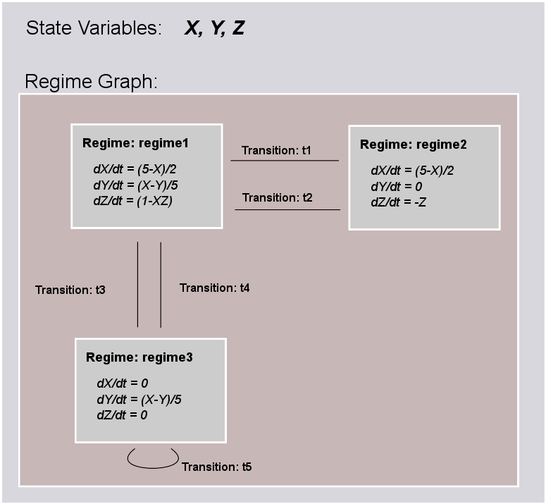

*****************
Abstraction Layer
*****************

Component Classes and Parameters
================================

The main building block of the Abstraction Layer is the ComponentClass.
The ComponentClass is intended to package together a collection of
objects that relate to the definition of a model (e.g. cells, synapses,
synaptic plasticity rules, random spike trains, inputs). All equations
and event declarations that are part of particular entity model, such as
neuron model, belong in a single ComponentClass. A ComponentClass can be
used to represent either a specific model of a neuron or a composite
model, including synaptic mechanisms.

The interface is the *external* view of the ComponentClass that defines
what inputs and outputs the component exposes to other ComponentClass
elements and the parameters that can be set for the ComponentClass. The
interface consists of instances of ports and Parameter (see
[fig:component\_class\_overview]).

.. figure:: figures/component_simple.pdf
   :alt: ComponentClass Overview
   :width: 16.00000cm

   ComponentClass Overview

 

As well as being able to specify the communication of continuous values,
ComponentClass elements are also able to specify the emission and the
reception of events. Events are discrete notifications that are
transmitted over event ports. Since Event ports have names, saying that
we transmit ‘event1’ for example would mean transmitting an event on the
EventPort called ‘event1’. Events can be used for example to signal
action potential firing.

ComponentClass
--------------

+-----------+-------------+----------+
| Attribute | Type/Format | Required |
+===========+=============+==========+
| name      | identifier  | yes      |
+-----------+-------------+----------+

+----------------------------------------------+--------------+----------+
| Children                                     | Multiplicity | Required |
+==============================================+==============+==========+
| Parameter                                    | set          | no       |
+----------------------------------------------+--------------+----------+
| AnalogSendPort                               | set          | no       |
+----------------------------------------------+--------------+----------+
| AnalogReceivePort                            | set          | no       |
+----------------------------------------------+--------------+----------+
| AnalogReducePort                             | set          | no       |
+----------------------------------------------+--------------+----------+
| EventSendPort                                | set          | no       |
+----------------------------------------------+--------------+----------+
| EventReceivePort                             | set          | no       |
+----------------------------------------------+--------------+----------+
| [Dynamics,ConnectionRule,RandomDistribution] | singleton    | yes      |
+----------------------------------------------+--------------+----------+

A ComponentClass is composed of:

-  Parameter objects for the ComponentClass, which specify which values
   are required to be provided in the User Layer.

-  An unordered collection of port objects, which either publish or read
   state variables or derived values published from other components in
   the case of analog send and receive ports, or emit events or listen
   for events emitted from components. EventSendPort and
   EventReceivePort objects raise and listen for events passed between
   dynamic components.

-  A ‘main’ block, which specifies the nature of the component class:

   -  Dynamics, the component class defines a dynamic element such as
      neutron or post-synaptic response.

   -  ConnectionRule, the component class defines a rule by which
      populations are connected in projections.

   -  RandomDistribution, the component class defines random
      distribution.

Name attribute
^^^^^^^^^^^^^^

Each ComponentClass requires a *name* attribute, which should be a valid
and uniquely identify the ComponentClass in the document scope.

Parameter
---------

+-----------+----------------+----------+
| Attribute | Type/Format    | Required |
+===========+================+==========+
| name      | identifier     | yes      |
+-----------+----------------+----------+
| dimension | Dimension.name | yes      |
+-----------+----------------+----------+

Parameter objects are placeholders for numerical values within a
ComponentClass. They define particular qualities of the model, such as
the firing threshold, reset voltage or the decay time constant of a
synapse model. By definition, Parameters are set at the start of the
simulation, and remain constant throughout.

Name attribute
^^^^^^^^^^^^^^

Each Parameter requires a *name* attribute, which is a valid and
uniquely identifies the Parameter within the ComponentClass.

Dimension attribute
^^^^^^^^^^^^^^^^^^^

Parameter elements must have a *dimension* attribute. This attribute
specifies the dimension of the units of the quantity that is expected to
be passed to the Parameter and should refer to the name of a Dimension
element in the document scope. For a dimensionless parameters a
Dimension with all attributes of power 0 can be used.

Mathematical Expressions
========================

As of NineML version 1.0, only inline mathematical expressions, which
have similar syntax to the ANSI C89 standard, are supported. In future
versions it is envisaged that inline expressions will be either
augmented or replaced with MathML (http://mathml.org) expressions.

MathInline
----------

+-------------------------+----------+
| Body format             | Required |
+=========================+==========+
| Inline-maths expression | yes      |
+-------------------------+----------+

MathInline blocks are used to specify mathematical expressions.
Depending on the context, MathInline blocks should return an expression
that evaluates to either a (when used as the trigger for OnCondition
objects) or a (when used as a right-hand-side for Alias, TimeDerivative
and StateAssignment objects). All numbers/variables in inline maths
expressions are assumed to be .

Body
^^^^

The following arithmetic operators are supported in all inline maths
expressions and have the same interpretation and precedence levels as in
the ANSI C89 standard,

-  Addition ``+``

-  Subtraction ``-``

-  Division ``/``

-  Multiplication ``*``

The following inequality and logical operators are only supported in
inline maths expressions within Trigger elements. They also have the
same interpretation and precedence levels as in ANSI C89 standard.

-  Greater than ``>``

-  Lesser than ``<``

-  Logical And: ``&&``

-  Logical Or: ``||``

-  Logical Not: ``!``

The following functions are built in and are defined as per ANSI C89:

-  ``exp(x)``

-  ``sin(x)``

-  ``cos(x)``

-  ``log(x)``

-  ``log10(x)``

-  ``pow(x, p)``

-  ``sinh(x)``

-  ``cosh(x)``

-  ``tanh(x)``

-  ``sqrt(x)``

-  ``atan(x)``

-  ``asin(x)``

-  ``acos(x)``

-  ``asinh(x)``

-  ``acosh(x)``

-  ``atanh(x)``

-  ``atan2(x)``

The following symbols are built in, and cannot be redefined,

-  pi

-  t

where :math:`pi` is the mathematical constant :math:`\pi`, and :math:`t`
is the elapsed simulation time within a Dynamics block.

The following random distributions are available in StateAssignment
elements via the ``random`` namespace, :

-  ``random.uniform`` (see http://uncertml.org/distributions/uniform)

-  ``random.normal`` (see http://uncertml.org/distributions/normal)

-  ``random.binomial(N,P)`` (see
   http://uncertml.org/distributions/binomial)

-  ``random.poisson(L)`` (see http://uncertml.org/distributions/poisson)

-  ``random.exponential(L)`` (see
   http://uncertml.org/distributions/exponential)

Alias
-----

+-----------+-------------+----------+
| Attribute | Type/Format | Required |
+===========+=============+==========+
| name      | identifier  | yes      |
+-----------+-------------+----------+

+------------+--------------+----------+
| Children   | Multiplicity | Required |
+============+==============+==========+
| MathInline | singleton    | yes      |
+------------+--------------+----------+

An alias corresponds to an alternative name for a variable or part of an
expression.

**Aliases** are motivated by two use cases:

-  **substitution**: rather than writing long expressions for functions
   of state variables, we can split the expressions into a chain of
   Alias objects, e.g.

   ::

       m_alpha = (alphaA + alphaB * V)/(alphaC + exp((alphaD + V / alphaE)))
       m_beta = (betaA + betaB * V)/(betaC + exp((betaD + V / betaE)))
       minf = m_alpha / (m_alpha + m_beta)
       mtau = 1.0 / (m_alpha + m_beta)
       dm/dt = (1 / C) * (minf - m) / mtau

   In this case, ``m_alpha``, ``m_beta``, ``minf`` and ``mtau`` are all
   alias definitions. There is no reason we couldn’t expand our
   :math:`\mathrm{d}m/\mathrm{d}t` description out to eliminate these
   intermediate Alias objects, but the expression would be very long and
   difficult to read.

-  **Accessing intermediate variables**: if we would like to communicate
   a value other than a simple StateVariable to another ComponentClass.
   For example, if we have a component representing a neuron, which has
   an internal StateVariable, ‘V’, we may be interested in transmitting
   a current, for example :math:`i=g*(E-V)`.

Name attribute
^^^^^^^^^^^^^^

Each Alias requires a *name* attribute, which is a valid and uniquely
identifies the Alias from all other elements in the ComponentClass.

Constant
--------

+-----------+-------------+----------+
| Attribute | Type/Format | Required |
+===========+=============+==========+
| name      | identifier  | yes      |
+-----------+-------------+----------+
| units     | Unit.symbol | yes      |
+-----------+-------------+----------+

+-------------+----------+
| Body format | Required |
+=============+==========+
| ``float``   | yes      |
+-------------+----------+

Constant objects are used to specify physical constants such as the
Ideal Gas Constant (i.e. 8.314462175
JK\ :math:`^{-1}`\ mol\ :math:`^{-1}`) or Avogadro’s number (i.e.
6.0221412927\ :math:`\times`\ 10\ :math:`^{23}`\ mol\ :math:`^{-1}`),
and to convert unit dimensions between abstract mathematical quantities.

The use of Constant elements to hold fixed model parameters is *strongly
discouraged* since this breaks the division of semantic layers
(abstraction and user), which is a key feature of NineML (see
[sec:scope]).

Name attribute
^^^^^^^^^^^^^^

Each Constant requires a *name* attribute, which should be a valid and
uniquely identify the Dimension in current the scope.

Units attribute
^^^^^^^^^^^^^^^

Each Constant requires a *units* attribute. The *units* attribute
specifies the units of the property and should refer to the name of a
Unit element in the document scope.

Body
^^^^

Any valid numeric value, including shorthand scientific notation e.g.
1e-5 (:math:`1\times10^{-5}`).

Ports
=====

Ports allow components to communicate with each other during a
simulation. Ports can either transmit discrete events or continuous
streams of analog data. Events are typically used to transmit and
receive spikes between neutron model, whereas analog ports can be used
to model injected current and gap junctions between neuron models.

Ports are divided into sending, EventSendPort and AnalogSendPort, and
receiving objects, EventReceivePort, AnalogReceivePort and
AnalogReducePort. With the exception of AnalogReducePort objects, each
receive port must be connected to exactly one matching (i.e.
analog\ :math:`\to`\ analog, event\ :math:`\to`\ event) send port, where
as a send port can be connected any number of receive ports.
AnalogReducePort objects can be connected to any number of
AnalogSendPort objects; the values of the connected ports are then
“reduced” to a single data stream using the *operator* provided to the
AnalogReducePort.

AnalogSendPort
--------------

+-----------+----------------------------+----------+
| Attribute | Type/Format                | Required |
+===========+============================+==========+
| name      | [StateVariable,Alias].name | yes      |
+-----------+----------------------------+----------+
| dimension | Dimension.name             | yes      |
+-----------+----------------------------+----------+

AnalogSendPort objects allow variables from the current component to be
published externally so they can be read by other ComponentClass
objects. Each AnalogSendPort can be connected to multiple
AnalogReceivePort and AnalogReducePort objects.

Name attribute
^^^^^^^^^^^^^^

Each AnalogSendPort requires a *name* attribute, which should refer to a
StateVariable or Alias within the current ComponentClass.

Dimension attribute
^^^^^^^^^^^^^^^^^^^

Each AnalogSendPort requires a *dimension* attribute. This attribute
specifies the dimension of the units of the quantity that is expected to
be passed through the AnalogSendPort and should refer to the name of a
Dimension element in the document scope.

AnalogReceivePort
-----------------

+-----------+----------------+----------+
| Attribute | Type/Format    | Required |
+===========+================+==========+
| name      | identifier     | yes      |
+-----------+----------------+----------+
| dimension | Dimension.name | yes      |
+-----------+----------------+----------+

AnalogReceivePorts allow variables that have been published externally
to be used within the current component. Each AnalogReceivePort must be
connected to exactly *one* AnalogSendPort.

Name attribute
^^^^^^^^^^^^^^

Each AnalogReceivePort requires a *name* attribute, which is a valid and
uniquely identifies the AnalogReceivePort from all other elements in the
ComponentClass.

Dimension attribute
^^^^^^^^^^^^^^^^^^^

Each AnalogReceivePort requires a *dimension* attribute. This attribute
specifies the dimension of the units of the quantity that is expected to
be passed through the AnalogReceivePort and should refer to the name of
a Dimension element in the document scope.

AnalogReducePort
----------------

+-----------+----------------+----------+
| Attribute | Type/Format    | Required |
+===========+================+==========+
| name      | identifier     | yes      |
+-----------+----------------+----------+
| dimension | Dimension.name | yes      |
+-----------+----------------+----------+
| operator  | \+             | yes      |
+-----------+----------------+----------+

Reduce ports can receive data from any number of AnalogSendPort objects
(including none). An AnalogReducePort takes an additional operator
compared to an AnalogReceivePort, operator, which specifies how the data
from multiple analog send ports should be combined to produce a single
value. Currently, the only supported operation is :math:`+`, which
calculates the sum of the incoming port values.

The motivation for AnalogReducePort is that it allows us to make our
ComponentClass definitions more general. For example, if we are defining
a neuron, we would define an AnalogReducePort called *InjectedCurrent*.
This allows us to write the membrane equation for that neuron as
:math:`\mathrm{d}V/\mathrm{d}t = (1/C) * InjectedCurrent`.

Then, when we connect this neuron to synapses, current-clamps, etc, we
simply need to connect the send ports containing the currents of these
ComponentClasses to the *InjectedCurrent* reduce port, without having to
change our original ComponentClass definitions.

Name attribute
^^^^^^^^^^^^^^

Each AnalogReducePort requires a *name* attribute, which is a valid and
uniquely identifies the AnalogReducePort from all other elements in the
ComponentClass.

Dimension attribute
^^^^^^^^^^^^^^^^^^^

Each AnalogReducePort requires a *dimension* attribute. This attribute
specifies the dimension of the units of the quantity that is expected to
be communicated through the AnalogReducePort and should refer to the
name of a Dimension element in the document scope.

Operator attribute
^^^^^^^^^^^^^^^^^^

Each AnalogReducePort requires an *operator* attribute. The operator
reduces the connected inputs to a single value at each time point. For
example the following port,

.. code-block:: xml

    <AnalogReducePort name="total_membrane_current" dimension="current" operator="+"/>

will take all of the electrical currents that have been connected to it
via AnalogSendPorts and sum them to get the total current passing
through the membrane.

EventSendPort
-------------

+-----------+-------------+----------+
| Attribute | Type/Format | Required |
+===========+=============+==========+
| name      | identifier  | yes      |
+-----------+-------------+----------+

An EventSendPort specifies a channel over which events can be
transmitted from a component. Each EventSendPort can be connected any
number of EventReceivePort objects.

Name attribute
^^^^^^^^^^^^^^

Each EventSendPort requires a *name* attribute, which is a valid and
uniquely identifies the EventSendPort from all other elements in the
ComponentClass.

EventReceivePort
----------------

+-----------+-------------+----------+
| Attribute | Type/Format | Required |
+===========+=============+==========+
| name      | identifier  | yes      |
+-----------+-------------+----------+

An EventReceivePort specifies a channel over which events can be
received by a component. Each EventReceivePort must be connected to
exactly *one* EventSendPort.

Name attribute
^^^^^^^^^^^^^^

Each EventReceivePort requires a *name* attribute, which is a valid and
uniquely identifies the EventReceivePort from all other elements in the
ComponentClass.

Dynamic Regimes
===============

Dynamics blocks define the dynamic equations of models such as neurons,
post-synaptic responses or plasticity of synaptic weights. In Dynamics
blocks, state variables are evolved by one or more sets of ordinary
differential equations (ODE). Each set of equations is called a regime,
and only one regime can be active at a particular point in time. The
currently active regime can be changed by a transition event, which is
represented as a logical expression on the state variables. When the
logical expression evaluates to true, the transition must occur.

[fig:simple\_regime\_graph] illustrates a hypothetical transition graph
for a system with three state variables, :math:`X`, :math:`Y` and
:math:`Z`, which transitions between three ODE regimes, *regime1*,
*regime2* and *regime3*. At any time, the model will be in one and only
one of these regimes, and the state variables will evolve according to
the ODE of that regime.

   The dynamics block for an example component.

 

Dynamics
--------

+---------------+--------------+----------+
| Children      | Multiplicity | Required |
+===============+==============+==========+
| StateVariable | set          | no       |
+---------------+--------------+----------+
| Regime        | set          | yes      |
+---------------+--------------+----------+
| Alias         | set          | no       |
+---------------+--------------+----------+
| Constant      | set          | no       |
+---------------+--------------+----------+

The Dynamics block represents the *internal* mechanisms governing the
behaviour of the component. These dynamics are based on ordinary
differential equations (ODE) but may contain non-linear transitions
between different ODE regimes. The regime graph (e.g.
[fig:simple\_regime\_graph]) must contain at least one Regime element,
and contain no regime islands. At any given time, a component will be in
a single regime, and can change which regime it is in through
transitions.

.. note::
    Alias objects are defined in Dynamics blocks, not Regime blocks. This means
    that aliases are the same across all regimes.

StateVariable
-------------

+-----------+----------------+----------+
| Attribute | Type/Format    | Required |
+===========+================+==========+
| name      | identifier     | yes      |
+-----------+----------------+----------+
| dimension | Dimension.name | yes      |
+-----------+----------------+----------+

The state of the model is defined by a set of StateVariable objects. The
value of a StateVariable can change in two ways:

    -  continuously through TimeDerivative elements (in Regime
       elements), which define how the StateVariable evolves over time,
       e.g. :math:`dX/dt=1-X`.

    -  discretely through StateAssignment (in OnCondition or OnEvent
       transition elements), which make discrete changes to a
       StateVariable value, e.g. :math:`X = X + 1`.

Name attribute
^^^^^^^^^^^^^^

Each StateVariable requires a *name* attribute, which is a valid and
uniquely identifies the StateVariable from all other elements in the
ComponentClass.

Dimension attribute
^^^^^^^^^^^^^^^^^^^

Each StateVariable requires a *dimension* attribute. This attribute
specifies the dimension of the units of the quantities that
StateVariable is expected to be initialised and updated with and should
refer to the name of a Dimension element in the document scope.

Regime
------

+-----------+-------------+----------+
| Attribute | Type/Format | Required |
+===========+=============+==========+
| name      | identifier  | yes      |
+-----------+-------------+----------+

+----------------+--------------+----------+
| Children       | Multiplicity | Required |
+================+==============+==========+
| TimeDerivative | set          | no       |
+----------------+--------------+----------+
| OnCondition    | set          | no       |
+----------------+--------------+----------+
| OnEvent        | set          | no       |
+----------------+--------------+----------+

A Regime element represents a system of ODEs in time on StateVariable.
As such, Regime defines how the state variables change (propagate in
time) between subsequent transitions.

Name attribute
^^^^^^^^^^^^^^

Each Regime requires a *name* attribute, which is a valid and uniquely
identifies the Regime from all other elements in the ComponentClass.

TimeDerivative
--------------

+-----------+--------------------+----------+
| Attribute | Type/Format        | Required |
+-----------+--------------------+----------+
| variable  | StateVariable.name | yes      |
+-----------+--------------------+----------+

+------------+--------------+----------+
| Children   | Multiplicity | Required |
+============+==============+==========+
| MathInline | singleton    | yes      |
+------------+--------------+----------+

TimeDerivative elements contain a mathematical expression for the
right-hand side of the ODE

.. math:: \frac{\mathrm{d} variable}{\mathrm{d} t} = expression

which can contain of references to any combination of StateVariable,
Parameter, AnalogReceivePort, AnalogReducePort and Alias elements with
the exception of aliases that are derived from RandomDistribution
components. Therefore, only one TimeDerivative element is allowed per
StateVariable per Regime. If a TimeDerivative for a StateVariable is not
defined in a Regime, it is assumed to be zero.

Variable attribute
^^^^^^^^^^^^^^^^^^

Each TimeDerivative requires a *variable* attribute. This should refer
to the name of a StateVariable in the ComponentClass. Only one
TimeDerivative is allowed per *variable* in each Regime.

Transitions
===========

The currently active dynamic regime can be changed via transitions.
Transitions have instantaneous temporal extent (i.e. they are
event-like). There are two types of transitions, condition-triggered
transitions (see OnCondition), which are evoked when an associated
trigger expression becomes true, or event-triggered transitions (see
OnEvent), which are evoked when an associated event port receives an
event from an external component. Multiple state assignments can be
defined and multiple events can be sent within a single transition
block.

During either type of transition three instantaneous actions can occur:

-  The component transitions to a target regime (can be the same as the
   current regime)

-  State variables can be assigned new values (see StateAssignment)

-  The component can send events (see OutputEvent).

There is no order defined in transitions; this means that the order of
resolution of state assignments can be ambiguous. If, for example, we
have two transitions, T1 and T2, originating from the same Regime, in
which T1 contains the state assignment *V=V+1* and T2 contains the
assignment *V=V\*V*, and both transitions are triggered simultaneously,
then there is no guarantee about the value of V. It is left to the user
to ensure such situations do not occur. Implementations should emit a
warning when they are detected.

OnCondition
-----------

+--------------+-------------+----------+
| Attribute    | Type/Format | Required |
+--------------+-------------+----------+
| targetRegime | Regime.name | no       |
+--------------+-------------+----------+

+-----------------+--------------+----------+
| Children        | Multiplicity | Required |
+=================+==============+==========+
| Trigger         | singleton    | yes      |
+-----------------+--------------+----------+
| StateAssignment | set          | no       |
+-----------------+--------------+----------+
| OutputEvent     | set          | no       |
+-----------------+--------------+----------+

OnCondition blocks are activated when the mathematical expression in the
Trigger block becomes true. They are typically used to model spikes in
spiking neuron models, potentially emitting spike events and/or
transitioning to an explicit refractory regime.

TargetRegime attribute
^^^^^^^^^^^^^^^^^^^^^^

An OnEvent can have a *targetRegime* attribute, which should refer to
the name of a Regime element in the ComponentClass that the dynamics
block will transition to when the trigger condition is met. If the
*targetRegime* attribute is omitted the regime will transition to
itself.

OnEvent
-------

+--------------+-----------------------+----------+
| Attribute    | Type/Format           | Required |
+--------------+-----------------------+----------+
| targetRegime | Regime.name           | no       |
+--------------+-----------------------+----------+
| port         | EventReceivePort.name | yes      |
+--------------+-----------------------+----------+

+-----------------+--------------+----------+
| Children        | Multiplicity | Required |
+=================+==============+==========+
| StateAssignment | set          | no       |
+-----------------+--------------+----------+
| OutputEvent     | set          | no       |
+-----------------+--------------+----------+

OnEvent blocks are activated when the dynamics component receives an
event from an external component on the port the OnEvent element is
“listening” to. They are typically used to model the transient response
to spike events from incoming synaptic connections.

*Cascading* of events, i.e. events triggering subsequent events, are
permitted, which in theory could be recursive through components
depending on their connectivity. It is the user’s responsibility to
ensure that infinite recursion does not occur with zero delay.
Implementations may decide to terminate after a given number of
recursive cascades of zero delay (say 1000) to prevent infinite loops,
but such limits should be modifiable by the user.

Port attribute
^^^^^^^^^^^^^^

Each OnEvent requires a *port* attribute. This should refer to the name
of an EventReceivePort in the ComponentClass interface.

TargetRegime attribute
^^^^^^^^^^^^^^^^^^^^^^

OnEvent can have a *targetRegime* attribute, which should refer to the
name of a Regime element in the ComponentClass that the dynamics block
will transition to when the OnEvent block is triggered by an incoming
event. If the *targetRegime* attribute is omitted the regime will
transition to itself.

Trigger
-------

+------------+--------------+----------+
| Children   | Multiplicity | Required |
+============+==============+==========+
| MathInline | singleton    | yes      |
+------------+--------------+----------+

Trigger objects define when an OnCondition transition should occur. The
MathInline block of a Trigger can contain any arbitrary combination of
‘and’, ‘or’ and ‘negation’ *logical operations* (‘:math:`\&\&`’,
‘:math:`||`’ and ‘:math:`!`’ respectively) on the result of pure
inequality *relational operations* (‘:math:`>`’ and ‘:math:`<`’), which
follow the syntax and semantics of ANSI C89. The inequality expression
may contain references to StateVariable, AnalogReceivePort,
AnalogReducePort, Parameter and Alias elements, with the exception of
Alias elements derived from random distributions. The OnCondition block
is triggered when the boolean result of the Trigger statement changes
from *false* to *true*.

StateAssignment
---------------

+-----------+--------------------+----------+
| Attribute | Type/Format        | Required |
+-----------+--------------------+----------+
| variable  | StateVariable.name | yes      |
+-----------+--------------------+----------+

+------------+--------------+----------+
| Children   | Multiplicity | Required |
+============+==============+==========+
| MathInline | singleton    | yes      |
+------------+--------------+----------+

StateAssignment elements allow discontinuous changes in the value of
state variables. Only one state assignment is allowed per variable per
transition block. The assignment expression may contain references to
StateVariable, AnalogReceivePort, AnalogReducePort, Parameter and Alias
elements, including Alias elements derived from random distributions.
State assignments are typically used to reset the membrane voltage after
an outgoing spike event or update post-synaptic response states after an
incoming spike event.

Variable attribute
^^^^^^^^^^^^^^^^^^

Each StateAssignment requires a *variable* attribute. This should refer
to the name of a StateVariable in the ComponentClass. Only one
StateAssignment is allow per *variable* in each OnEvent or OnCondition
block.

OutputEvent
-----------

+-----------+--------------------+----------+
| Attribute | Type/Format        | Required |
+===========+====================+==========+
| port      | EventSendPort.name | yes      |
+-----------+--------------------+----------+

OutputEvent elements specify events to be raised during a transition.
They are typically used to raise spike events from within OnCondition
elements.

Port attribute
^^^^^^^^^^^^^^

Each OutputEvent requires a *port* attribute. This should refer to the
name of an EventSendPort in the ComponentClass interface.

Random Distributions
====================

Values for a property across all elements in a container (e.g. cells in
a population, post-synaptic responses, plasticity rules or delays in a
projection) can be defined as a random distribution by a Component
within a RandomValue element. A random distribution component must
parameterize a ComponentClass with a RandomDistribution block; the
component class defines the random distribution family (e.g. normal,
cauchy, gamma, etc...). As of version 1.0, the only random distributions
available to the user are those defined in the standard library,
however, derived distributions are planned for future versions.

RandomDistribution
------------------

+------------------+-----------------------------------------------------------------+----------+
| Attribute        | Type/Format                                                     | Required |
+==================+=================================================================+==========+
| standard_library | `URL <http://en.wikipedia.org/wiki/Uniform_resource_locator>`__ | yes      |
+------------------+-----------------------------------------------------------------+----------+

The names and parameters of the random distribution in the standard
library match the UncertML definitions that can be found at
http://www.uncertml.org/distributions. The subset of the UncertML
distributions that should be implemented are by NineML compliant
packages are,

-  BernoulliDistribution

-  BetaDistribution

-  BinomialDistribution

-  CauchyDistribution

-  ChiSquareDistribution

-  DirichletDistribution

-  ExponentialDistribution

-  FDistribution

-  GammaDistribution

-  GeometricDistribution

-  HypergeometricDistribution

-  LaplaceDistribution

-  LogisticDistribution

-  LogNormalDistribution

-  MultinomialDistribution

-  NegativeBinomialDistribution

-  NormalDistribution

-  ParetoDistribution

-  PoissonDistribution

-  UniformDistribution

-  WeibullDistribution

.. note::
    Note: C implementations of these distributions are available in the
    GNU Scientific Library, http://www.gnu.org/software/gsl/

Standard\_library attribute
^^^^^^^^^^^^^^^^^^^^^^^^^^^

The *standard\_library* attribute is required and should point to a
`URL <http://en.wikipedia.org/wiki/Uniform_resource_locator>`__\ in the
http://www.uncertml.org/distributions/ directory.

Network Connectivity
====================

The connection rule for cells in the source and destination populations
of a Projection (i.e. the rule that determines which source cells are
connected to which destination cells) is defined by a connection-rule
component within the Connectivity element of the Projection. This
component must parameterize a ComponentClass with a ConnectionRule
block, which describes the connection algorithm. As of version 1.0, the
only connection rules available to the user are those defined in the
standard library (e.g. all-to-all, one-to-one, probabilistic, etc...),
however, custom connectivity rules are planned for future versions.

ConnectionRule
--------------

+------------------+-----------------------------------------------------------------+----------+
| Attribute        | Type/Format                                                     | Required |
+==================+=================================================================+==========+
| standard_library | `URL <http://en.wikipedia.org/wiki/Uniform_resource_locator>`__ | yes      |
+------------------+-----------------------------------------------------------------+----------+

Connection rules must be one of 6 standard library types,
*all-to-all*, *one-to-one*, *probabilistic*, *explicit*,
*random-fan-out* and *random-fan-in*, provided to the
*standard\_libarary* attribute.
  
.. note::
    In future versions, built-in connectivity rules are to be replaced with
    mathematically expressed connection rules.

Standard\_library attribute
^^^^^^^^^^^^^^^^^^^^^^^^^^^

The *standard\_library* attribute is required and should point to the
`URL <http://en.wikipedia.org/wiki/Uniform_resource_locator>`__\ in
the
`http://nineml.net/9ML/1.0/connectionrules/ <http://nineml.net/9ML/1.0/\-connectionrules/>`__
directory that corresponds to the desired connection rule.

All cells in the source population are connected to all cells in the
destination population.

Each cell in the source population is connected to the cell in the
destination population with the corresponding index. Note that this
requires that the source and destination populations be the same size.

All cells in the source population are connected to cells in the
destination population with a probability defined by a parameter, which
should be named *probability*. The properties supplied to the
*probability* parameter should either be a SingleValue representing the
probability of a connection between all source and destination cell
pairs, or a ArrayValue or ExternalArrayValue of size :math:`M{\times}N`,
where :math:`M` and :math:`N` are the size of the source and destination
populations respectively. For array probabilities, the data in the
ArrayValue or ExternalArrayValue are ordered by the indices

.. math:: i_{\mathrm{prob}} = i_{\mathrm{source}} * N_{\mathrm{dest}} + i_{\mathrm{dest}}

where :math:`i_{\mathrm{prob}}`, :math:`i_{\mathrm{source}}` and
:math:`i_{\mathrm{dest}}` are the indices of the probability entry, and
the source and destination cells respectively, and
:math:`N_{\mathrm{dest}}` is the size of the destination population.

Cells in the source population are connected to cells in the destination
population as specified by an explicit arrays. The source and
destination are defined via parameters, which should be named
*sourceIndicies* and *destinationIndicies* parameters respectively.

The properties supplied to the *sourceIndicies* parameter should be a
ArrayValue or ExternalArrayValue drawn from the set
:math:`\{1,\ldots,M\}` where :math:`M` is the size of the source
population and be the same length as the property supplied to the
*target-indices* parameter.

The properties supplied to the *destinationIndicies* parameter should be
a ArrayValue or ExternalArrayValue drawn from the set
:math:`\{1,\ldots,N\}` where :math:`N` is the size of the source
population and be the same length as the property supplied to the
*source-indices* parameter.

Each cell in the source population is connected to a fixed number of
randomly selected cells in the destination population. The number of
cells is specified by the parameter *number*. The property supplied to
the *number* parameter should be a SingleValue.

Each cell in the destination population is connected to a fixed number
of randomly selected cells in the source population. The number of cells
is specified by the parameter *number*. The property supplied to the
*number* parameter should be a SingleValue.
